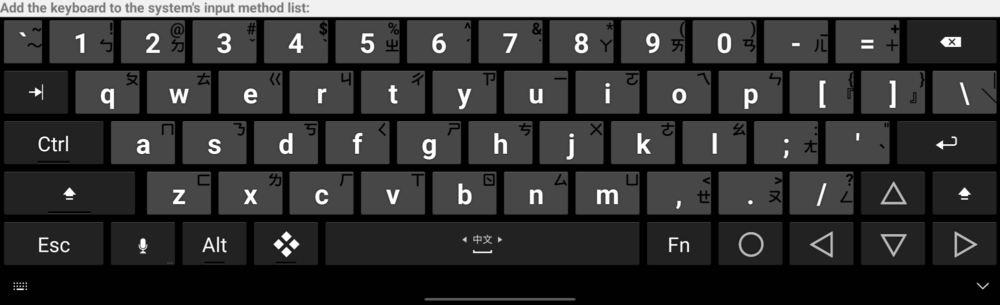
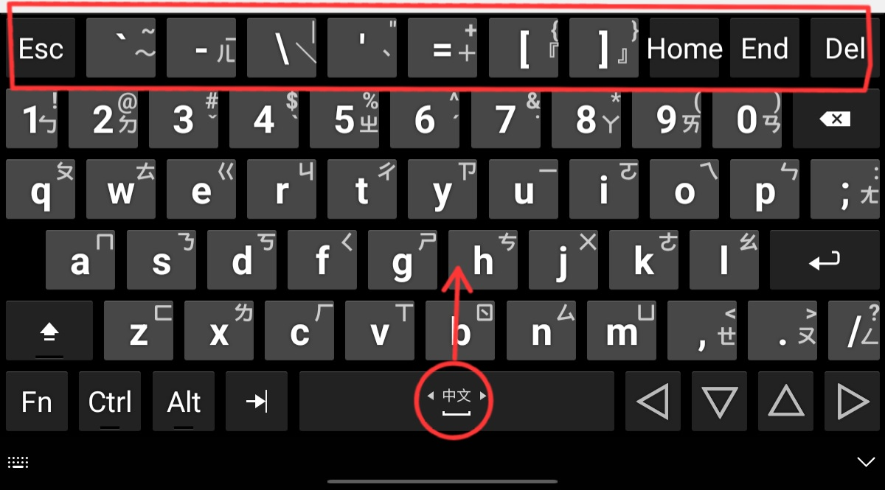

## [Hacker's Keyboard](https://play.google.com/store/apps/details?id=org.pocketworkstation.pckeyboard) with Zhuyin Hint Text Layout
  
This fork of [Klaus's Hacker's Keyboard](https://github.com/klausw/hackerskeyboard) adds a new layout:  
- Traditional Chinese (Taiwan; Zhuyin mapped to English) (zh-TW)  
  
### Improvements
- Updated `build.gradle` and build files for compatibility with newer Android Studio versions (requires manually switching to JDK 11 for successful compilation)  
- Added zh-TW language layout with Zhuyin as *AltChars* for keyboard hints  
- Included common full-width symbols used in Chinese environments  
- Improved the zh-TW 5-row compact layout, changing the `quote` button to `semi-colon` button to enhance the Zhuyin typing experience  
  
### Recommended Zhuyin Layout Options
- **For tablet users**, enable the `Full 5-row Layout` for the best Zhuyin typing experience!  
    
- **For small-screen devices**, consider using the `Compact 5-row Layout` and enable the `Popup Mini Keyboard` setting. By long-pressing the `;` key, you can enter the `-` symbol for the `ㄦ` Zhuyin.  
  (Alternatively, you can activate an additional sixth row input using the *spacebar swipe-down gesture*!)  
    
    
  
### Build Instructions
- Clone this project and open it in Android Studio  
- Configure Gradle settings to use an older JDK version (recommended: Eclipse Temurin JDK 11.0.26)  
- The project uses Gradle Plugin version 7.4.1 and Gradle Wrapper version 8.5  
  