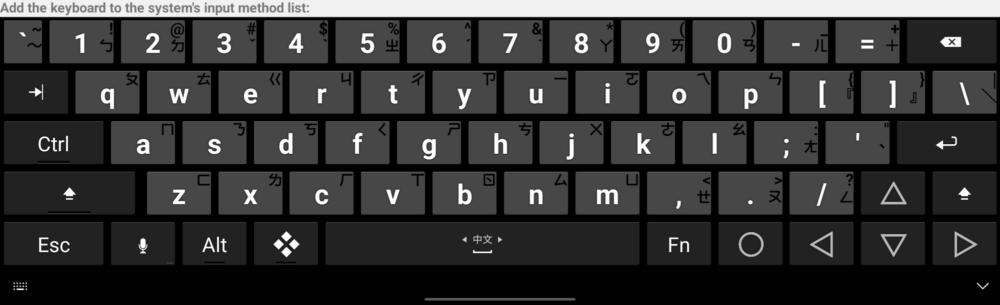
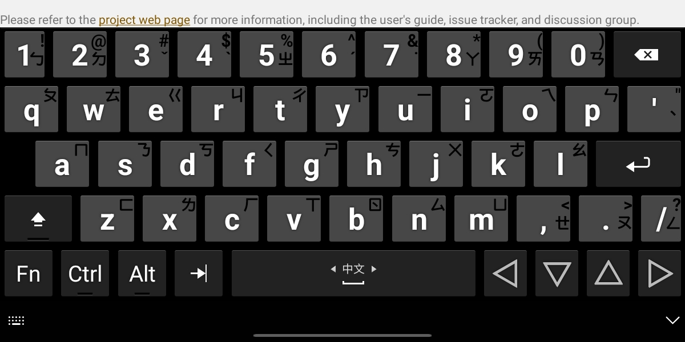
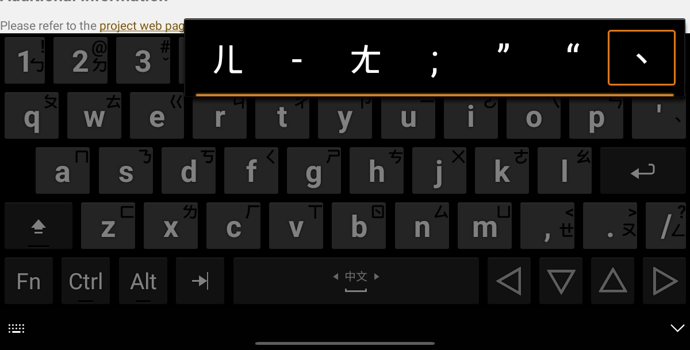

## [Hacker's Keyboard](https://play.google.com/store/apps/details?id=org.pocketworkstation.pckeyboard) 的注音提示鍵盤布局

這個專案是 [Klaus's Hacker's Keyboard](https://github.com/klausw/hackerskeyboard) 的分支，新增了一個鍵盤布局：
- 繁體中文 (台灣；注音對應英文) (zh-TW)
- [For English user's README is here!](README-en.md)

### 改進內容
- 更新 `build.gradle` 和建置檔案，以相容於新版 Android Studio (需手動切換至 JDK 11 才能成功編譯)
- 新增 zh-TW 語言布局，並將注音作為鍵盤提示的 *AltChars*
- 包含中文環境常用的全形符號
- 改進 zh-TW 的五列精簡布局，將 `單引號` 按鍵改為 `分號` 按鍵，以提升注音輸入體驗

### 注音鍵盤布局建議
- **使用大型平板的使用者**，建議直接開啟 `完整五列布局`，獲得最佳的注音輸入體驗！
  
- **使用小型螢幕裝置的使用者**，可以考慮使用 `五列，精簡布局`，並啟用 `彈出式迷你鍵盤` 設定。長按 `;` 按鍵可輸入 `-` 符號，對應 `ㄦ` 注音。
  (另外，也可以透過 *空白鍵下滑手勢* 啟動額外的第六列輸入！)
  
  

### 編譯指南
- 複製 (clone) 此專案並在 Android Studio 開啟
- 調整 Gradle 設定，使其使用較舊版本的 JDK (建議使用：Eclipse Temurin JDK 11.0.26)
- 專案使用 Gradle Plugin 版本 7.4.1 和 Gradle Wrapper 版本 8.5
